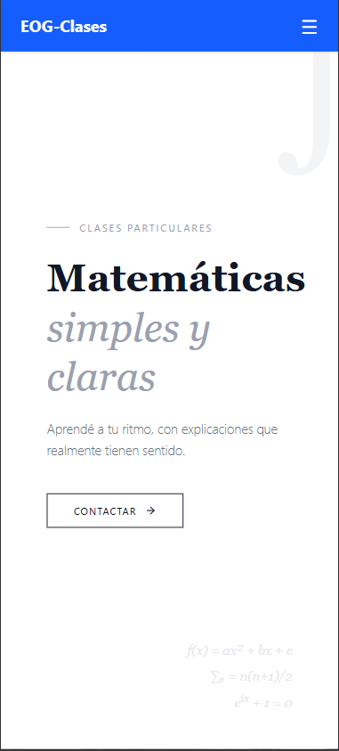
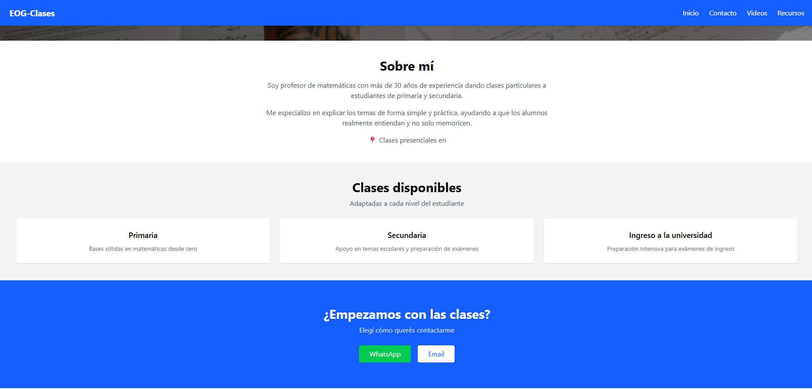

# 📘 EOG Clases - Landing Page

Landing page para un Profesor de matemáticas.

El proyecto está desarrollado con React + Vite y desplegado en Vercel.

---

## 🌐 Demo en vivo

 https://eog-clases.vercel.app

---

## 📸 Capturas del proyecto




##  Tecnologías utilizadas

- React
- Vite
- TypeScript
- Tailwind CSS
- React Router DOM
- Vercel (deploy)

---

##  Características del proyecto

- Landing page moderna y responsive
- Secciones informativas:
  - Hero principal
  - Clases disponibles
  - Videos promocionales
  - Material de estudio
  - Sobre el profesor
  - CTA de contacto
- Navegación con React Router
- Menú hamburguesa en mobile
- Integración con WhatsApp y email
- Videos promocionales en formato vertical tipo redes sociales

---

## 📱 Contacto

- WhatsApp 
- Email:   

---

## ⚙️ Instalación y ejecución

```bash
pnpm install
pnpm dev